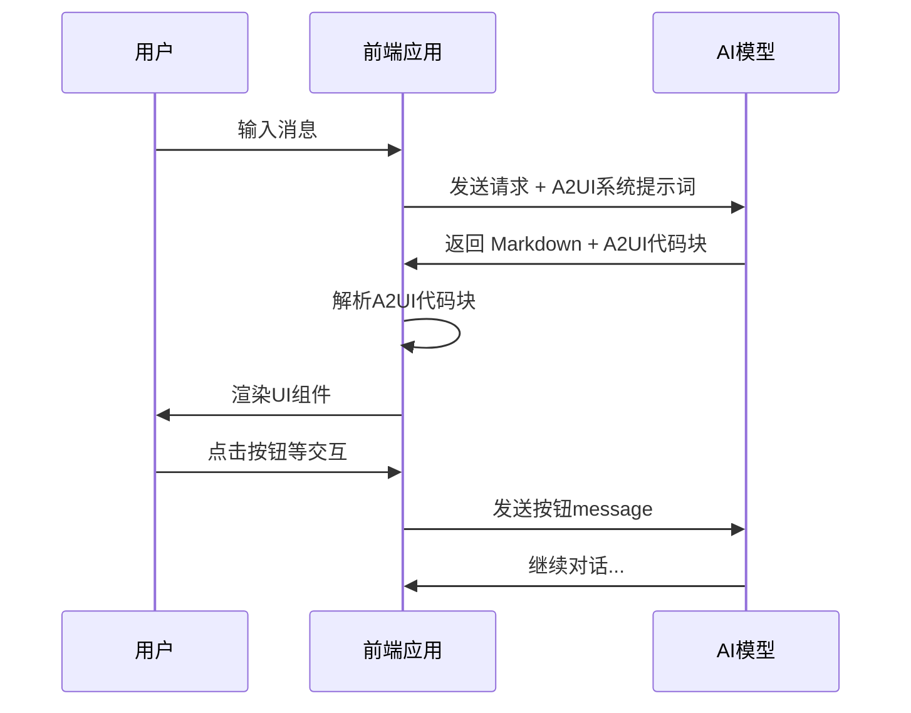
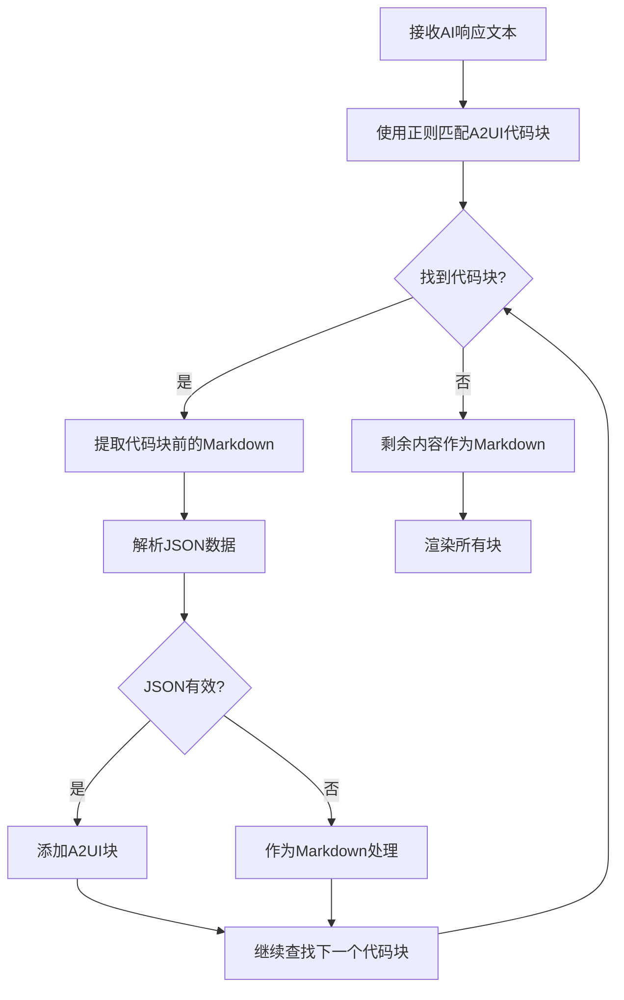

# A2UI协议开发指南

> **A2UI (AI-Augmented UI)** 是一种让AI助手返回结构化UI组件的轻量级协议，使AI回复不再局限于纯文本，而是能够展示卡片、按钮、列表、图表等丰富的交互界面。

---

## 目录

1. [协议概述](#协议概述)
2. [核心概念](#核心概念)
3. [协议格式规范](#协议格式规范)
4. [支持的组件类型](#支持的组件类型)
5. [系统提示词设计](#系统提示词设计)
6. [前端实现架构](#前端实现架构)
7. [完整实现步骤](#完整实现步骤)
8. [示例对话](#示例对话)

---

## 协议概述

### 什么是A2UI协议？

A2UI协议是一种**在Markdown中嵌入结构化UI组件**的通信协议。它允许AI模型在普通Markdown文本中穿插使用特殊标记的JSON代码块，前端解析这些代码块后渲染为真实的UI组件。

### 协议特点

| 特点 | 说明 |
|------|------|
| **轻量级** | 仅在Markdown代码块基础上扩展，无需复杂协议 |
| **向后兼容** | 不支持A2UI的客户端仍可显示原始JSON代码块 |
| **模型无关** | 适用于任何大语言模型（OpenAI、Gemini等） |
| **可扩展** | 组件类型可根据需求自由扩展 |

### 工作原理



---

## 核心概念

### 1. A2UI代码块

A2UI组件通过特殊的代码块标记，与普通Markdown内容混合使用：

````markdown
这是普通的Markdown文本，支持**加粗**、*斜体*等格式。

```a2ui
{
  "type": "card",
  "title": "卡片标题",
  "content": "这是卡片内容"
}
```

这里可以继续写Markdown文本。
````

### 2. 组件类型 (type)

每个A2UI代码块必须包含 `type` 字段，用于指定组件类型：

- `card` - 卡片组件
- `button` - 按钮组件
- `list` - 列表组件
- `chart` - 图表组件

### 3. 交互式组件

按钮等交互组件支持 `message` 属性，定义用户点击后发送给AI的消息：

```json
{
  "type": "button",
  "label": "了解更多",
  "message": "请详细介绍这个功能"
}
```

当用户点击此按钮，"请详细介绍这个功能" 会作为新消息发送给AI，实现多轮交互。

---

## 协议格式规范

### 代码块语法

```
```a2ui
{JSON对象}
```                   # 注意：结束标记必须独占一行
```

### JSON结构

| 字段 | 类型 | 必需 | 说明 |
|------|------|------|------|
| `type` | string | ✅ | 组件类型标识符 |
| `title` | string | ❌ | 组件标题 |
| `content` | string | ❌ | 主要内容 |
| `description` | string | ❌ | 描述文字 |
| `items` | array | ❌ | 列表/数据项 |
| `actions` | array | ❌ | 操作按钮列表 |
| `message` | string | ❌ | 交互后发送的消息 |

---

## 支持的组件类型

### 1. Card 卡片组件

用于展示结构化信息，支持标题、描述、内容和操作按钮。

**JSON规范：**

```json
{
  "type": "card",
  "title": "卡片标题",
  "description": "卡片描述（可选）",
  "content": "卡片主要内容",
  "actions": [
    {"label": "按钮1", "message": "用户点击后发送的消息1"},
    {"label": "按钮2", "message": "用户点击后发送的消息2"}
  ]
}
```

**属性说明：**

| 属性 | 类型 | 说明 |
|------|------|------|
| `title` | string | 卡片标题 |
| `description` | string | 简短描述 |
| `content` | string | 正文内容 |
| `actions` | array | 操作按钮数组 |
| `actions[].label` | string | 按钮显示文字 |
| `actions[].message` | string | 点击后发送的消息 |

---

### 2. Button 按钮组件

独立的按钮组件，用于触发操作或继续对话。

**JSON规范：**

```json
{
  "type": "button",
  "label": "按钮文字",
  "message": "点击后发送给AI的消息",
  "variant": "primary"
}
```

**属性说明：**

| 属性 | 类型 | 可选值 | 说明 |
|------|------|--------|------|
| `label` | string | - | 按钮显示文字 |
| `message` | string | - | 点击后发送的消息 |
| `variant` | string | `primary`, `secondary` | 按钮样式 |

---

### 3. List 列表组件

用于展示条目列表。

**JSON规范：**

```json
{
  "type": "list",
  "title": "列表标题",
  "items": ["项目1", "项目2", "项目3"]
}
```

**属性说明：**

| 属性 | 类型 | 说明 |
|------|------|------|
| `title` | string | 列表标题 |
| `items` | string[] | 列表项数组 |

---

### 4. Chart 图表组件

用于数据可视化展示。

**JSON规范：**

```json
{
  "type": "chart",
  "title": "图表标题",
  "chartType": "bar",
  "data": [
    {"label": "类别A", "value": 100},
    {"label": "类别B", "value": 200},
    {"label": "类别C", "value": 150}
  ]
}
```

**属性说明：**

| 属性 | 类型 | 说明 |
|------|------|------|
| `title` | string | 图表标题 |
| `chartType` | string | 图表类型（目前支持 `bar`） |
| `data` | array | 数据点数组 |
| `data[].label` | string | 数据标签 |
| `data[].value` | number | 数据值 |

---

## 系统提示词设计

要让AI模型输出A2UI格式，需要在系统提示词中明确说明协议规范。以下是本Demo使用的完整系统提示词：

```text
你是一个支持A2UI协议的AI助手。除了普通文本回复，你可以返回结构化UI组件。

使用A2UI组件时，请用以下格式包裹JSON：
```a2ui
{JSON对象}
```

支持的组件类型：

1. **card** - 卡片组件
{
  "type": "card",
  "title": "标题",
  "description": "描述文字",
  "content": "主要内容",
  "actions": [{"label": "按钮文字", "message": "用户点击后发送给你的消息"}]
}

2. **button** - 按钮组件
{
  "type": "button",
  "label": "按钮文字",
  "message": "点击后发送给你的消息",
  "variant": "primary|secondary"
}

3. **list** - 列表组件
{
  "type": "list",
  "title": "列表标题",
  "items": ["项目1", "项目2", "项目3"]
}

4. **chart** - 图表组件
{
  "type": "chart",
  "title": "图表标题",
  "chartType": "bar",
  "data": [{"label": "A", "value": 100}, {"label": "B", "value": 200}]
}

**重要**: 按钮的message属性定义了用户点击按钮后会发送给你的消息，
你收到这个消息后应该继续对话。这样可以实现多轮交互。

你可以在普通Markdown文本中穿插使用这些组件。请根据用户需求选择合适的组件展示信息。
```

---

## 前端实现架构

### 项目结构

```
a2ui/
├── app/
│   ├── page.js              # 主页面，包含API调用和系统提示词
│   ├── globals.css          # 全局样式
│   └── page.module.css      # 页面样式
├── components/
│   ├── ChatBox.js           # 聊天框容器
│   ├── MessageItem.js       # 单条消息渲染（路由到不同渲染器）
│   ├── renderers/
│   │   ├── MarkdownRenderer.js   # 纯Markdown渲染器
│   │   └── A2UIRenderer.js       # A2UI协议渲染器（核心！）
│   └── a2ui/
│       ├── Card.js          # 卡片组件实现
│       ├── Button.js        # 按钮组件实现
│       ├── List.js          # 列表组件实现
│       └── Chart.js         # 图表组件实现
├── package.json
└── next.config.js
```

### 核心组件：A2UIRenderer

`A2UIRenderer.js` 是整个协议的核心解析器，负责：

1. **解析A2UI代码块** - 使用正则表达式识别 ` ```a2ui ` 代码块
2. **分离内容** - 将Markdown和A2UI组件分离成独立的块
3. **渲染组件** - 根据 `type` 字段调用对应的组件

**解析算法流程：**



**关键代码：**

```javascript
// 匹配A2UI代码块的正则表达式
const a2uiRegex = /```a2ui\r?\n([\s\S]*?)\r?\n```/g

const parseContent = (text) => {
    const parsedBlocks = []
    let lastIndex = 0
    let match

    while ((match = a2uiRegex.exec(text)) !== null) {
        // 添加A2UI块之前的Markdown内容
        if (match.index > lastIndex) {
            parsedBlocks.push({
                type: 'markdown',
                content: text.slice(lastIndex, match.index)
            })
        }

        // 解析并添加A2UI块
        try {
            const a2uiData = JSON.parse(match[1])
            parsedBlocks.push({
                type: 'a2ui',
                data: a2uiData
            })
        } catch (e) {
            // JSON解析失败，作为Markdown处理
            parsedBlocks.push({
                type: 'markdown',
                content: match[0]
            })
        }

        lastIndex = match.index + match[0].length
    }

    // 添加剩余内容
    if (lastIndex < text.length) {
        parsedBlocks.push({
            type: 'markdown',
            content: text.slice(lastIndex)
        })
    }

    return parsedBlocks
}
```

---

## 完整实现步骤

按照以下步骤，您可以从零开始构建一个支持A2UI协议的应用：

### 第一步：创建Next.js项目

```bash
npx create-next-app@latest a2ui-demo
cd a2ui-demo
```

### 第二步：安装依赖

```bash
npm install marked highlight.js dompurify
```

**依赖说明：**

| 依赖 | 用途 |
|------|------|
| `marked` | Markdown解析器 |
| `highlight.js` | 代码语法高亮 |
| `dompurify` | HTML净化（防XSS） |

### 第三步：创建A2UI组件

在 `components/a2ui/` 目录下创建四个组件文件：

#### Card.js

```javascript
'use client'

import styles from './Card.module.css'

export default function A2UICard({ title, content, description, actions = [], onAction }) {
    const handleAction = (action) => {
        if (onAction) {
            const message = action.message || action.label || '用户点击了按钮'
            onAction(message)
        }
    }

    return (
        <div className={styles.card}>
            {title && <h3 className={styles.title}>{title}</h3>}
            {description && <p className={styles.description}>{description}</p>}
            {content && <div className={styles.content}>{content}</div>}
            {actions.length > 0 && (
                <div className={styles.actions}>
                    {actions.map((action, index) => (
                        <button key={index} onClick={() => handleAction(action)}>
                            {action.label || '操作'}
                        </button>
                    ))}
                </div>
            )}
        </div>
    )
}
```

#### Button.js

```javascript
'use client'

import styles from './Button.module.css'

export default function A2UIButton({ label, message, variant = 'primary', onAction }) {
    const handleClick = () => {
        if (onAction) {
            onAction(message || label || '用户点击了按钮')
        }
    }

    return (
        <button className={`${styles.button} ${styles[variant]}`} onClick={handleClick}>
            {label || '按钮'}
        </button>
    )
}
```

#### List.js

```javascript
'use client'

import styles from './List.module.css'

export default function A2UIList({ title, items = [] }) {
    const safeItems = Array.isArray(items) ? items : []

    return (
        <div className={styles.list}>
            {title && <h3 className={styles.title}>{title}</h3>}
            {safeItems.length > 0 ? (
                <ul className={styles.items}>
                    {safeItems.map((item, index) => (
                        <li key={index}>{String(item)}</li>
                    ))}
                </ul>
            ) : (
                <p>暂无列表项</p>
            )}
        </div>
    )
}
```

#### Chart.js

```javascript
'use client'

import { useEffect, useRef } from 'react'
import styles from './Chart.module.css'

export default function A2UIChart({ title, chartType = 'bar', data = [] }) {
    const canvasRef = useRef(null)
    const safeData = Array.isArray(data) ? data.filter(d => d && typeof d.value === 'number') : []

    useEffect(() => {
        if (canvasRef.current && safeData.length > 0) {
            drawBarChart()
        }
    }, [safeData])

    const drawBarChart = () => {
        const canvas = canvasRef.current
        const ctx = canvas.getContext('2d')
        const width = canvas.width
        const height = canvas.height

        ctx.clearRect(0, 0, width, height)

        const maxValue = Math.max(...safeData.map(d => d.value))
        const barWidth = (width - 40) / safeData.length - 10

        safeData.forEach((item, index) => {
            const barHeight = (item.value / maxValue) * (height - 60)
            const x = 40 + index * (barWidth + 10)
            const y = height - 40 - barHeight

            // 绘制柱子
            ctx.fillStyle = '#00d4ff'
            ctx.fillRect(x, y, barWidth, barHeight)

            // 绘制标签
            ctx.fillStyle = '#ffffff'
            ctx.textAlign = 'center'
            ctx.fillText(item.label, x + barWidth / 2, height - 20)
            ctx.fillText(item.value.toString(), x + barWidth / 2, y - 5)
        })
    }

    return (
        <div className={styles.chart}>
            {title && <h3>{title}</h3>}
            <canvas ref={canvasRef} width={600} height={300} />
        </div>
    )
}
```

### 第四步：创建A2UI渲染器

在 `components/renderers/A2UIRenderer.js` 创建核心解析器：

```javascript
'use client'

import { useState, useEffect } from 'react'
import MarkdownRenderer from './MarkdownRenderer'
import A2UICard from '../a2ui/Card'
import A2UIButton from '../a2ui/Button'
import A2UIList from '../a2ui/List'
import A2UIChart from '../a2ui/Chart'

export default function A2UIRenderer({ content, onAction }) {
    const [blocks, setBlocks] = useState([])

    useEffect(() => {
        if (content) {
            parseContent(content)
        }
    }, [content])

    const parseContent = (text) => {
        const parsedBlocks = []
        const a2uiRegex = /```a2ui\r?\n([\s\S]*?)\r?\n```/g
        let lastIndex = 0
        let match

        while ((match = a2uiRegex.exec(text)) !== null) {
            // Markdown块
            if (match.index > lastIndex) {
                const markdownContent = text.slice(lastIndex, match.index)
                if (markdownContent.trim()) {
                    parsedBlocks.push({ type: 'markdown', content: markdownContent })
                }
            }

            // A2UI块
            try {
                const a2uiData = JSON.parse(match[1])
                parsedBlocks.push({ type: 'a2ui', data: a2uiData })
            } catch (e) {
                parsedBlocks.push({ type: 'markdown', content: match[0] })
            }

            lastIndex = match.index + match[0].length
        }

        // 剩余Markdown
        if (lastIndex < text.length) {
            const remaining = text.slice(lastIndex)
            if (remaining.trim()) {
                parsedBlocks.push({ type: 'markdown', content: remaining })
            }
        }

        if (parsedBlocks.length === 0) {
            parsedBlocks.push({ type: 'markdown', content: text })
        }

        setBlocks(parsedBlocks)
    }

    const renderA2UIComponent = (data, index) => {
        switch (data.type) {
            case 'card':
                return <A2UICard key={index} {...data} onAction={onAction} />
            case 'button':
                return <A2UIButton key={index} {...data} onAction={onAction} />
            case 'list':
                return <A2UIList key={index} {...data} />
            case 'chart':
                return <A2UIChart key={index} {...data} />
            default:
                return <div key={index}>未知组件: {data.type}</div>
        }
    }

    return (
        <div>
            {blocks.map((block, index) => {
                if (block.type === 'markdown') {
                    return <MarkdownRenderer key={index} content={block.content} />
                } else if (block.type === 'a2ui') {
                    return renderA2UIComponent(block.data, index)
                }
                return null
            })}
        </div>
    )
}
```

### 第五步：创建Markdown渲染器

在 `components/renderers/MarkdownRenderer.js`：

```javascript
'use client'

import { useEffect, useState } from 'react'
import { marked } from 'marked'
import hljs from 'highlight.js'
import 'highlight.js/styles/atom-one-dark.css'

marked.setOptions({
    highlight: function (code, lang) {
        if (lang && hljs.getLanguage(lang)) {
            return hljs.highlight(code, { language: lang }).value
        }
        return hljs.highlightAuto(code).value
    },
    breaks: true,
    gfm: true
})

export default function MarkdownRenderer({ content }) {
    const [html, setHtml] = useState('')

    useEffect(() => {
        if (content) {
            const rawHtml = marked(content)
            if (typeof window !== 'undefined') {
                import('dompurify').then(({ default: DOMPurify }) => {
                    setHtml(DOMPurify.sanitize(rawHtml))
                })
            } else {
                setHtml(rawHtml)
            }
        }
    }, [content])

    return (
        <div className="markdown-body" dangerouslySetInnerHTML={{ __html: html }} />
    )
}
```

### 第六步：配置API调用

在主页面中配置API调用，关键是在系统提示词中包含A2UI协议说明：

```javascript
const systemPrompt = `你是一个支持A2UI协议的AI助手...` // 见上文完整系统提示词

// OpenAI API调用示例
const response = await fetch('https://api.openai.com/v1/chat/completions', {
    method: 'POST',
    headers: {
        'Content-Type': 'application/json',
        'Authorization': `Bearer ${apiKey}`
    },
    body: JSON.stringify({
        model: 'gpt-4',
        messages: [
            { role: 'system', content: systemPrompt },
            { role: 'user', content: userMessage }
        ]
    })
})
```

### 第七步：处理按钮交互

当用户点击A2UI按钮时，将按钮的 `message` 作为新消息发送给AI：

```javascript
// 在ChatBox或MessageItem中传递onAction回调
<MessageItem
    message={message}
    mode="a2ui"
    onAction={(actionMessage) => handleSendMessage(actionMessage)}
/>
```

---

## 示例对话

### 用户输入

```
帮我生成一个今日任务清单
```

### AI响应（A2UI格式）

````markdown
好的，这是您的今日任务清单：

```a2ui
{
  "type": "card",
  "title": "📋 今日任务",
  "description": "2024年12月19日",
  "content": "您今天有3项重要任务需要完成"
}
```

```a2ui
{
  "type": "list",
  "title": "待办事项",
  "items": [
    "完成项目文档编写",
    "参加下午3点的团队会议",
    "Review代码提交"
  ]
}
```

需要我帮您进一步规划吗？

```a2ui
{
  "type": "button",
  "label": "📊 查看详细排期",
  "message": "请帮我制定今天的详细时间安排"
}
```
````

### 渲染效果

前端将渲染：
1. 一个带标题和描述的卡片
2. 一个包含3个待办事项的列表
3. 一个可点击的按钮

用户点击按钮后，"请帮我制定今天的详细时间安排" 将作为新消息发送给AI，实现多轮交互。

---

## 扩展A2UI

要添加新的组件类型，只需：

1. **定义JSON规范** - 确定组件需要的属性
2. **创建React组件** - 在 `components/a2ui/` 下创建新组件
3. **更新渲染器** - 在 `A2UIRenderer.js` 的 `renderA2UIComponent` 中添加case
4. **更新系统提示词** - 告诉AI如何使用新组件

例如，添加一个图片组件：

```json
{
  "type": "image",
  "src": "https://example.com/image.jpg",
  "alt": "图片描述",
  "caption": "图片说明"
}
```

---

## 常见问题

### Q: 为什么AI没有返回A2UI格式？

确保系统提示词中包含完整的A2UI协议说明。有些模型可能需要更明确的指令。

### Q: JSON解析失败怎么办？

当JSON格式错误时，`A2UIRenderer` 会将其作为普通Markdown代码块显示，不会导致整体渲染失败。

### Q: 如何支持更多图表类型？

可以在 `Chart.js` 中添加更多绑图函数（如 `drawPieChart`、`drawLineChart`），并根据 `chartType` 属性选择调用。

---

## 许可证

MIT License

---

*文档生成于 2024年12月19日*
